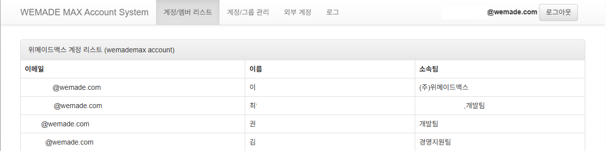
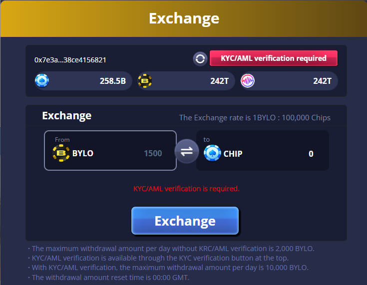

<!-- _class: title -->
>## 사용자의 다양한 편의성, 안정적인 개발환경 제공
>## 플랫폼과 기술지원에 관심이 많은

# 😄🙂 지원자 오정훈입니다  
### <https://github.com/cowboy779>  

---

## introduce [0]  
- ##### WEMADE MAX (LIGHTCON Co., Ltd 플랫폼 웹개발 기술지원팀)  
- ##### **웹기능 개발 6년차**  

라이트컨 경력으로 입사하여 현재는 웹개발자로 기술지원 파트를 담당하고 있습니다.  
팀 내 플랫폼 지원을 웹개발자를 신규로 자리편성하여, 
기술지원 및 안정화가 되도록 하는걸 목표로 하고 있습니다.  
현재는 기술지원팀 특성상 개발유지보수 인프라 구성이나 간단한 SVN/GIT 권한관리 및  
개발 VM 서버관리를 지원하고 있습니다.

> 모바일게임의 빠른 생존주기에 맞게 웹으로 전환되면서,
> 서버개발자 및 운영 사이에서 원활한 소통 협업과 가치창출을 위해 노력하고 있습니다.

---

## introduce [1]
저는 아래를 생각하고 고민합니다.

- 최소의 리소스로 최대의 효과  
- 성능 좋은 코드 < **읽기 좋은 코드**  
- 주석달린 코드 < **직관적인 코드**  
- 플랫폼 특성에 맞는 견고성 및 유지보수성 확보

---

## introduce [2]
저는 이것을 추구하고 열망합니다.  

- 최소의 장애방지를 위한 안정화된 개발 프로그램
- 사용자 편의 및 안정성을 위한 **DevOps(자동배포 및 스크립트화)**  
- **트러블 슈팅** (상태 추적, 로그분석, 문제해결)
- **성능 최적화** (규격화된 보일러플레이트, 협업툴 활용)

---

<!-- _backgroundImage: url('./images/bg_intro.jpg') -->
## Project [0]  
#### 프로모션 쿠폰 발급 시스템 구축
###### - **배경:** 자사내 다른게임에서도 연동해서 쓸수 있게 서버요청시 쿠폰 발급 기능
###### - **기술 스택:** PHP, MySQL
```php
$pendingMissionCodeList = array_diff($missionCodeList, array_keys($coupons));
if (count($pendingMissionCodeList) > 0) {
    $couponKey = LTFunction::getString('COUPONKEY', $couponData[0]);
    $result = createCrossPromoCoupons($couponId, $publisherId, $pendingMissionCodeList, $couponKey);
    if (is_string($result)) {
        return makeResponse(CouponResult::CROSSPROMO_ERROR_DB_INSERT, "Failed publish coupon (coupon_id : {$couponId}, mission_code : {$result}, publisher_id : {$publisherId})");
    }
    else {
        $coupons = array_merge($coupons, $result);
    }
}
return makeResponse(CouponResult::OK, $coupons);
```   
- **[cross-promotion](https://github.com/cowboy779/2025_resume-main/blob/main/html/admin/crosspromo/crosspromo.php)** : 쿠폰은 Admin에서 다량 생성해서 서버에서 처리하였지만,
  `이벤트 쿠폰은 서버에서 요청시 한장씩 동적 생성 후 등록한 작업이었습니다.`


---

## Project [1]  
### 라이트컨 웹 고객센터 FAQ 생성  
###### - **배경:** 구글 스토어 정책을 준수하며, 고객 개인정보 최소수집을 위한 이메일주소로만 페이지 구현  
###### - **기술 스택:** Python, flask, jinja2, MySQL  
- **[WEB FAQ](https://wemademax.com/faq)** : 고객센터 FAQ 페이지를 위한 데이터베이스 및 API 구축/ 관리툴 개발  
- 모바일 및 PC 웹에서 모두 접근 가능하도록 반응형 웹 구현/ 글로벌 서비스 대응
- 관리자 페이지에서 FAQ 콘텐츠 관리 기능 개발을 하였습니다.

---

## Project [2]  
  
### NAS LDAP 연동 및 전환 프로젝트
###### - **배경:** 내부 사내 NAS 시스템의 사용자 인증 및 권한 관리를 위해 LDAP 연동 
###### - **기술 스택:** NAS LDAP, Python, Php, MySQL

---

## Project [2]-2  
- **[LDAP LIST](https://github.com/cowboy779/2025_resume-main/blob/main/html/admin/ldap_login/internal.py)** : NAS LDAP 사용자 계정 리스트 조회 및 관리툴 개발
- 공통 그룹웨어가 아닌 내부에서 사용하기 위해, 사원 입퇴사 관리 조직 그룹망을 구현하기 위해 자동 batch > [batch script 보기](https://github.com/cowboy779/2025_resume-main/blob/main/html/admin/ldap_login/python_auto_shell/job_autoproc.py)
```
##### run_account.sh crontab 설정 예시
# 매주 월~금 09:30 ~ 19:30 매 시간 30분마다 실행
0,30 9-19 * * 1-5 /ltcon/account_site/run_account.sh

##### run_account.sh
#!/bin/bash
# 가상 환경 활성화
source /ltcon/venv/account_system/bin/activate
# Python 스케쥴링 스크립트 실행
python /ltcon/account_system/script/job_autoproc.py

```

---

## Project [3]
### 개발 테스트 서버 상황 및 내부그룹웨어 상황 알림시스템 필요
###### - **배경:** zabbix 모니터링 시스템과 내부 그룹웨어 상황 및 서버상태 알림을 위한 텔레그램 연동
###### - **기술 스택:** zabbix, Python, Php, Telegram API, SMTP, Linux
- **[Telegram-notifier](https://github.com/cowboy779/2025_resume-main/blob/main/html/admin/telegrame-smtp-autoload/telegram.py)**  
  Telegram API Bot 기반 및 SMTP 프로토콜을 사용한 메일 알림 라이브러리  
- 관리자 알림툴에서 `email, telegram, all` 선택적으로 알림 전송 가능을 구현하였습니다.

---

## improvement [0]
### 텔렘그램 및 SMTP 중복 방지 및 많은 양의 알림 전송 최적화
- 비동기 처리 및 재시도 메커니즘 구현으로 안정성 향상
- **[PHP : notifier](https://github.com/cowboy779/2025_resume-main/blob/main/html/admin/telegrame-smtp-autoload/job_notiqueue.php)**  =>  **[Python : notifier](https://github.com/cowboy779/2025_resume-main/blob/main/html/admin/telegrame-smtp-autoload/python_auto_shell/job_notiqueue.py)**  
  기존 php 에서는 child process fork 및 프로세스 병렬처리로 제어 구현하였지만, 
  대량의 알림이 발생할 경우, 중복 전송 및 지연 문제 해결을 위해 Lock 과 서브프로세스 Task로 비동기로 개선해 보았습니다.
  
flock으로 동시실행 방지 및 뮤텍스
```
if ((trim(file_get_contents("/proc/".posix_getppid()."/comm")) != 'flock')
        && (int)exec("pgrep -c -f '".basename(__FILE__)."'") > 1)
{
  exit;
}
```

---

## improvement [1]
### Google OAuth2 API 이용한 운영툴 로그인 통합
###### - **배경:** 정보통신망 이용촉진 및 정보보호 등에 관한 법률 및 ISO 보안심사 대응
###### - **기술 스택:** GCP, Google API
- **[Google Login](https://github.com/cowboy779/2025_resume-main/blob/main/html/admin/google/glogin.php)** : 개인을 식별할 수 있는 고유한 정보로 보다 안전하게 이용 및 관리가 필요함
- 내부에서 쓰던 개인 아이디/이메일 각 운영툴 Google 로그인으로 교체 
- GCP 에서 클라이언트 통합관리 -> 서버요청시 ID 전달
- OAuth 2.0 클라이언트 ID 를 부여함으로써 각 운영툴마다 액세스 분리처리하여 한곳에서 키를 받을 수있게 관리가 용이해졌습니다.


---
<!-- _class: img-small-right -->
## improvement [2]
### 바일로 칩 교환소 팝업 디자인 생성


- **[BYLO EXCHANGE](https://github.com/cowboy779/2025_resume-main/blob/main/html/admin/bylo_design/index.html)**  
  스테이블 코인 기반의 게임 내 재화 교환소  
  팝업 UI 디자인 및 구현  
- **[WEMIX](https://wemadetree.gitbook.io/wemix-play-tech-int-guide/about-wemix3.0/account)** 플랫폼과 연동
- HTML5, CSS3, JavaScript(jQuery) 기반의 웹 디자인 작업도 하였습니다.

---

## improvement [3]
### 홈페이지 운영약관 및 정책 업데이트 관리 개선
 - **[기업윤리 상담센터](https://www.wemademax.com/ethics)** : 신규페이지 개설
 - **[운영정책](https://docs.lightcon.net/policy/ko.html?date=20221104&idx=2#tab2)** : 기존 JS document.write() 형식으로 TEXT AREA 에서 정책을 수정 타이핑 작업하는걸 좀 더 가시성이 좋게 [summernote](https://summernote.org/) > WYSIWYG 도입하여 작업효율 개선
 - 그외 파일 생성하여 정책 수정/저장 하는걸 DB로 이관하여 인덱스 관리화로 개선해서 실제 운영팀에서 다량의 텍스트를 등록 현업에서 빠르게 처리할 수 있게 수정하였습니다.
(속도 및 잦은 정책변화로 인한 버전관리 용이해짐)


---

## security aspect [0]
### ROS 홈페이지 관련 Clickjacking  
- 재화 교환소 의도치 않은 접근방지
- 온라인 샵 구매 및 월렛 이용 후 토큰교환시  

X-Frame-Options
```
Nginx
add_header Content-Security-Policy "default-src 'self'; frame-ancestors 'self';" always;
add_header X-Frame-Options "DENY" always;
```
Response header에 보안 옵션 추가
```
PHP
header("Content-Security-Policy: frame-ancestors 'self' https://www.riseofstars.io;");
header("X-Frame-Options: SAMEORIGIN");
```

---
<!-- _class: section -->
## security aspect [1]
### Bot 방지 및 개발계정 비밀번호 변경 및 다량의 초기화 메일 송신방지
- [reCaptcha](https://github.com/cowboy779/2025_resume-main/blob/main/html/admin/recaptcha/recaptcha.php) : 일부 <span class="mark-blue">Google Login</span>이 적용 안된 내부사이트 보안을 위해 API 이용하여 방지
- 또한 자체 내부 비밀번호 검증 및 OTP 를 통한 2FA 보안하였습니다.

---

## security aspect [2]
### ISO 대응 각종 취약점 미비된 환경 방어
 - SQL 인젝션 파라미터 URL 호출 및 방어(SQL Prepared)
```php
$where = "COUPONID=:couponId";
$bind = [":couponId" => $couponID];
$couponData = SQLDBWrapper::GetSQLDB()->select(DBTable::COUPON_DATA, $where, $bind);
```
 - 응답헤더 버전 정보 노출 숨김처리
```
php
[root@localhost ~]# vim /etc/php.ini 
;expose_php = On
expose_php = Off
nginx 
[root@localhost ~]# vim /etc/nginx/nginx.conf
### version hide
server_tokens off; --추가
```

---

## security aspect [3]
  - XSS 방어 (출력시 HTML 특수문자 이스케이프)
  ```php
  function escapeHtml($string) {
      return htmlspecialchars($string, ENT_QUOTES, 'UTF-8');
  }
  ```
  - 세션 하이재킹 방어 (세션 고정 방지 및 쿠키 보안 설정) 통해 보안강화 하였습니다.
  ```python
  app.secret_key = 'xxx'  
  # -- 서버 사이드 세션 (cachelib 사용 예시) --
  app.config['SESSION_TYPE'] = 'cachelib' # 또는 'filesystem' 등 (라이브러리/버전에 따라 다름)
  app.config['SESSION_CACHELIB'] = FileSystemCache(cache_dir='/var/lib/flask_session') # MemcachedCache 이용
  app.config['SESSION_PERMANENT'] = True
  app.config['PERMANENT_SESSION_LIFETIME'] = timedelta(minutes=30) # 세션 사용시간 제한

  # -- 쿠키 보안 옵션 --
  app.config['SESSION_COOKIE_HTTPONLY'] = True   # JS에서 document.cookie로 접근 차단
  app.config['SESSION_COOKIE_SECURE'] = True     # https 전용 (운영환경에서만 True)
  app.config['SESSION_COOKIE_SAMESITE'] = 'Lax'  # 또는 'Strict' (CSRF GET이냐, same-site 요청만 허용이냐에 따라 다름)
  ```

---

<!-- _class: section -->
## 기술지원 Infra DevOPS [0]
 - 특정 port 허용 및 원외에서 들어오는 외부 방화벽 관리
 - 테스트 개발 VM 생성 및 특정 IP allow 작업
 - Login 유저 생성 및 SSH Shell 권한 부여 작업 
```
useradd test123
mkdir -p /home/test123/.ssh
vi /home/test123/.ssh/authorized_keys
visudo -f /etc/sudoers
ps -ef
```

---
<!-- _class: section -->
## 기술지원 Infra DevOps [1]
 - 트러블 슈팅 에러로그 관리
 - VM 용량 증가 및 swap 관리
```
1. vm 용량 조정
2. df-h 디스크 용량 확인
3. growpart /dev/sda 3
4. resize2fs /dev/sda3 (파일시스템이 ext4 일때)
5. xfs_growfs /dev/sda3 (파일시스템이 xfs 일때)
6. df -h
7. lsblk
```

---

## 기술지원 Infra DevOps [2]
 - Jenkins Execute shell 통해 자동배포 및 빌드관리 이용하였습니다.
```
rm -rf _syncspace
rsync -r ./*.wsgi admin api lib ./_syncspace --exclude=.svn
mkdir ./_syncspace/config
cp ./config/config.py.test ./_syncspace/config/config.py
rsync -r --rsync-path="sudo rsync" ./_syncspace/ ${TARGET_HOST}:${TARGET_DIR}

ssh ${TARGET_HOST} 'sudo touch /cowboy779/uwsgi.d/_admin.ini'
ssh ${TARGET_HOST} 'sudo touch /cowboy779/uwsgi.d/_api.ini'
```
 - SVN/GIT 소스 운영관리 및 권한 관리용 웹페이지 이식 및 빌드배포
 - Gitea 설치형 WEB Gitea 구축
 - SVN Tortoise 에서 개발계정 소스 운영관리 및 권한 관리용 **[iF.SVNAdmin](https://svnadmin.insanefactory.com)** 이식 및 빌드배포


---

## 기술지원 Infra DevOps [3]
- Nginx 리버스 프록시 관리 및 다수의 VM 포워딩 연결관리
- Nginx websocket 연결추가
```
nginx
server {
    listen   8080 ssl default_server;
    include  /etc/nginx/ssl/_ssl_net.setting;
    location / {
        proxy_pass http://localhost:8001;
        proxy_set_header X-Forwarded-For $proxy_add_x_forwarded_for;
        proxy_set_header X-Forwarded-Proto $scheme;
        proxy_http_version 1.1;# 
        proxy_set_header Upgrade $http_upgrade;# 
        proxy_set_header Connection "upgrade";# 
        proxy_set_header Host $host;#
    }
}
```

---
## 기술지원 Infra DevOps [4]
- Mysql dump 백업관리 쉘을 통해 특정 로그 및 파일들 이중화
```
db_backup.sh
ssh localhost "mysqldump -u testdump -p dumptable > _backup.sql"
scp 127.0.0.1:~/_backup.sql ./
mysql -h test.com -u testdump -p testdump < _backup.sql
```
```
# vim /etc/my.cnf
log-bin = mysql-bin
server-id = 1
binlog_format = row
expire_logs_days = 2
# slave
server-id = 2
```
```
`mySQL 8.0.23 이상` CHANGE REPLICATION SOURCE TO MASTER_HOST=...
GET_SOURCE_PUBLIC_KEY=1;(caching_sha2_password 오류 방지)
```

---

## 기술지원 Infra DevOps [5]
- fluentd 브로커 로그 관리(파일로 생성하여 전달 및 Bigquery나 운영 로그뷰어사용)
```php
static public function saveErrFile($message, $type) {
        $date = date("Ymd", time());
        $fileName = "{$type}_{$date}.err";
        file_put_contents(Config::LOG_PATH . $fileName, $message . "\n", FILE_APPEND);
    }
```
```
<source> #fluentd.conf
  @type tail
  path /cowboy779/log/error/*_%Y%m%d.err
  pos_file /var/log/td-agent/_system.err.pos
  read_from_head true
  <parse>
    @type json
    time_key LOGTM
  ...
</source>
  ```

---

## 기술지원 Infra DevOps [6]
 - Juniper 방화벽 관리 및 정책설정
 - 특정 IP 대역 및 포트 허용/차단 관리  
  Untrust, Trust zone 설정 및 정책 통해 초기 외부방화벽 설정
 - service set 사용자정의 프로토콜 등록처리

`위 해당 관리책임장은 팀장님이 정, 저는 부의 역할로 지정된 정책만 진행하였습니다.`

---

<!-- _class: section -->
# Thanks for Reading 🙌

| 구분 | 링크 |
|---|---|
| **GitHub** | `https://github.com/cowboy779` |
| **Email** | `cowboy779@naver.com` |
| **Mobile** | `010-8809-3586` |